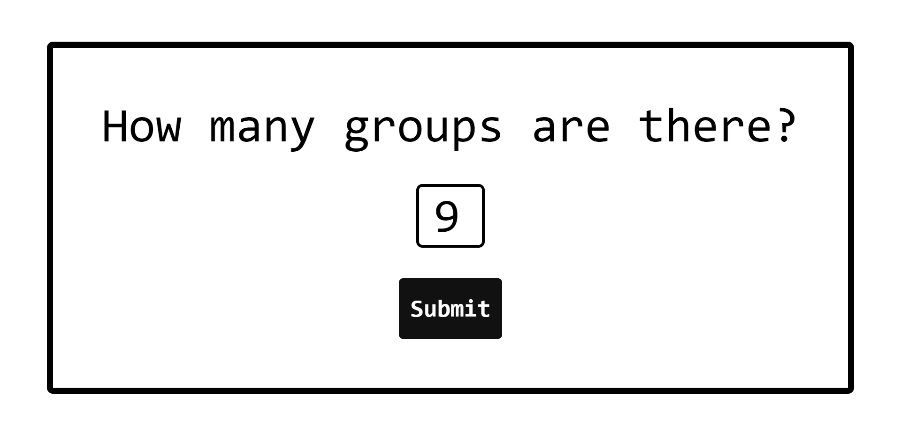

# Random Group Pairs

some crappy code I wrote at 1:40am to randomly pair up groups for the INFO 340 lab section that I am teaching 🥲

check out the [demo](https://henry-bao.github.io/random-group-pair/)

